# Lab 03: Booting Embedded Linux on Zynq FPGA Board


**Student:** Melnikov Sergei

**Target:** ZYNQ MINI (XC7Z020-2CLG400I)

**Tools:** Vivado 2025.2, PetaLinux 2025.2, OrbStack x86 VM (Ubuntu), macOS

---

## Table of Contents

1. [Overview](#1-overview)
2. [Hardware Description](#2-hardware-description)
3. [Boot Flow](#3-boot-flow)
4. [Vivado: Hardware Project & XSA Generation](#4-vivado-hardware-project--xsa-generation)
5. [Host Environment Setup](#5-host-environment-setup)
6. [PetaLinux Installation](#6-petalinux-installation)
7. [Unpack sstate Cache](#7-unpack-sstate-cache)
8. [PetaLinux Project Configuration](#8-petalinux-project-configuration)
9. [PetaLinux Rootfs Configuration](#9-petalinux-rootfs-configuration)
10. [PetaLinux Device Tree Overlay](#10-petalinux-device-tree-overlay)
11. [PetaLinux Build](#11-petalinux-build)
12. [PetaLinux Packaging](#12-petalinux-packaging)
13. [SD Card Image Preparation](#13-sd-card-image-preparation)
14. [Burning SD Card](#14-burning-sd-card)
15. [Connecting via UART (picocom)](#15-connecting-via-uart-picocom)
16. [Boot Result & Login](#16-boot-result--login)
17. [Troubleshooting](#17-troubleshooting)
18. [Conclusion](#18-conclusion)
19. [Appendix: prepare_sd_image.sh](#19-appendix-prepare_sd_imagesh)
<div style="page-break-after: always;"></div>

## 1. Overview

The goal of this lab is to build and boot an embedded Linux system on a Zynq-7000 FPGA board from an SD card. The complete boot chain is:

**BootROM → FSBL → U-Boot → Linux Kernel (+ initramfs) → Root Filesystem**

All software components are built using Xilinx PetaLinux 2025.2. The hardware description (XSA) is generated in Vivado. The final image is written to an SD card and booted on real hardware, with UART serial console used for interaction.

---

## 2. Hardware Description

| Parameter | Value |
|-----------|-------|
| Board | ZYNQ MINI |
| FPGA Part | XC7Z020-2CLG400I |
| Package | CLG400 |
| Speed Grade | -2 |
| Temperature | Industrial (I) |
| DDR | MT41J256M16 RE-125, 512 MB, 16-bit bus |
| PS Clock | 33.33 MHz |
| PL Clock | 50 MHz (FCLK_CLK0) |
| UART | UART1 on MIO48/49 (Bank 1, 1.8V) |
| USB-to-Serial | CH340 |
| Boot Source | SD Card (MIO[5:2] = 0110) |
| Bank 0 Voltage | LVCMOS 3.3V |
| Bank 1 Voltage | LVCMOS 1.8V |

> **Note:** The QR code on the chip is sanded off, making it impossible to read the marking directly. The Speed Grade (-2), part number, DDR model, MIO pinout, and all other hardware parameters were determined from the Chinese-language manufacturer documentation obtained from the board vendor.

<div style="page-break-after: always;"></div>

The following resources were prepared for the build and transferred to the x86 build VM:

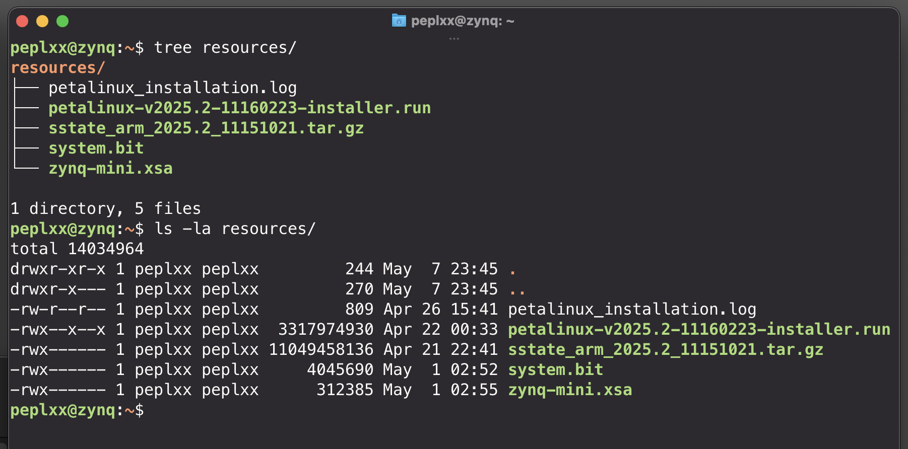

> **Note:** The XSA file shown here is 312 KB because the bitstream was exported separately as `system.bit`. Both files are used during the PetaLinux build — the XSA provides the hardware description and the .bit file is included in BOOT.BIN during the packaging step (Section 12).

---
<div style="page-break-after: always;"></div>

## 3. Boot Flow

```
┌─────────────────────────────────────────────────────────┐
│                    POWER ON                             │
└──────────────────────┬──────────────────────────────────┘
                       ▼
┌─────────────────────────────────────────────────────────┐
│  BootROM (hardcoded in Zynq silicon)                    │
│  Reads boot mode pins → selects SD card                 │
│  Loads FSBL from SD partition 1 (BOOT.BIN)              │
└──────────────────────┬──────────────────────────────────┘
                       ▼
┌─────────────────────────────────────────────────────────┐
│  FSBL (First Stage Boot Loader)                         │
│  - Initializes DDR3 (MT41J256M16, 16-bit, 512MB)        │
│  - Initializes MIO (UART1 on MIO48/49)                  │
│  - Programs PL with bitstream (.bit)                    │
│  - Loads U-Boot into DDR                                │
└──────────────────────┬──────────────────────────────────┘
                       ▼
┌─────────────────────────────────────────────────────────┐
│  U-Boot (Universal Bootloader)                          │
│  - Reads boot.scr from FAT32 partition                  │
│  - Loads image.ub (FIT image: kernel + DTB + initramfs) │
│  - Boots the Linux kernel                               │
└──────────────────────┬──────────────────────────────────┘
                       ▼
┌─────────────────────────────────────────────────────────┐
│  Linux Kernel                                           │
│  - Decompresses, initializes hardware via device tree   │
│  - Mounts initramfs as temporary root (/)               │
│  - Runs /init from initramfs                            │
└──────────────────────┬──────────────────────────────────┘
                       ▼
┌─────────────────────────────────────────────────────────┐
│  initramfs → Root Filesystem                            │
│  - Mounts real rootfs from /dev/mmcblk0p2 (ext4)        │
│  - switch_root to real rootfs                           │
│  - /sbin/init (SysVinit) starts services                │
│  - Login prompt on UART console (ttyPS0)                │
└─────────────────────────────────────────────────────────┘
```

---
<div style="page-break-after: always;"></div>

## 4. Vivado: Hardware Project & XSA Generation

### 4.1 Create Project

1. Open Vivado 2025.2
2. Create Project → **RTL Project**
3. Select part: **xc7z020clg400-2**

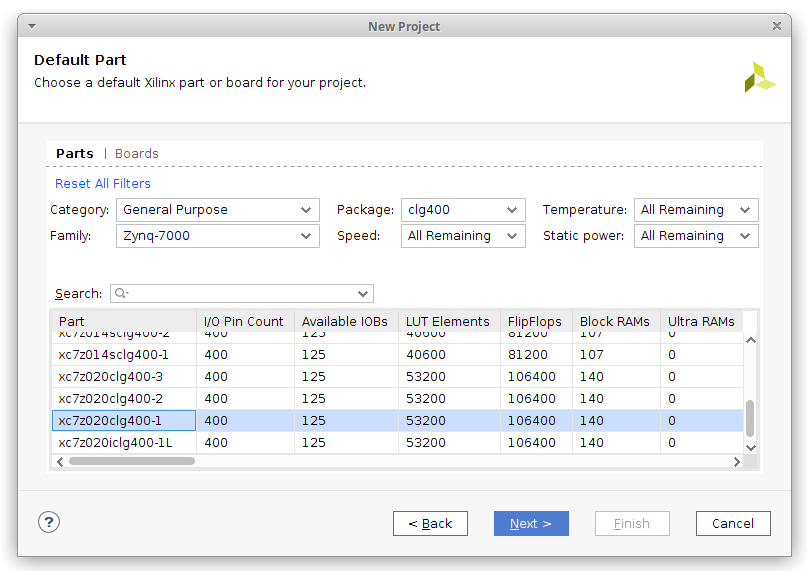

### 4.2 Create Block Design

Once the IP core is ready, we can create a Block Design and link all the logic together:

1. Click **Create Block Design** → name: `system`
2. Add **ZYNQ7 Processing System** via Add IP
3. Click **Run Block Automation** → OK

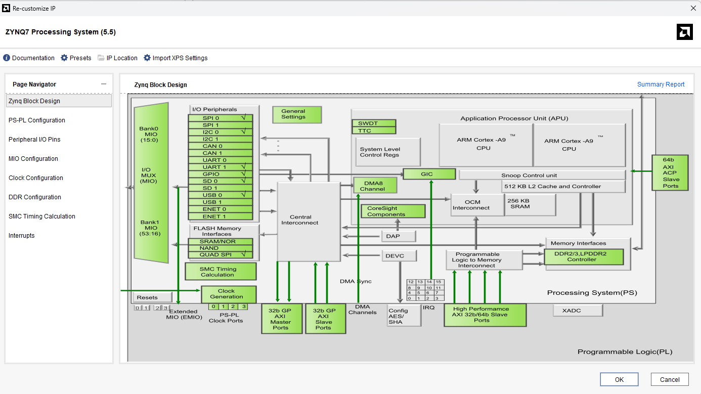

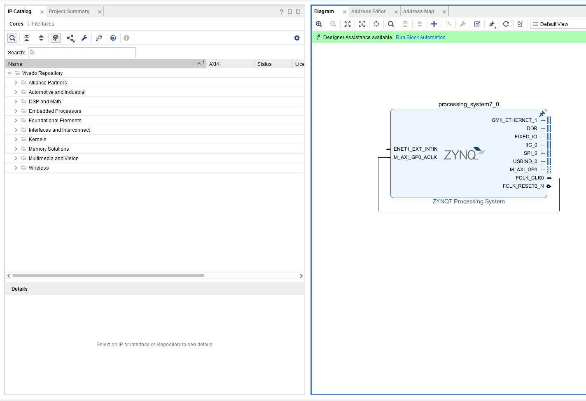
---
<div style="page-break-after: always;"></div>

### 4.3 Configure Zynq PS

**MIO Configuration:**

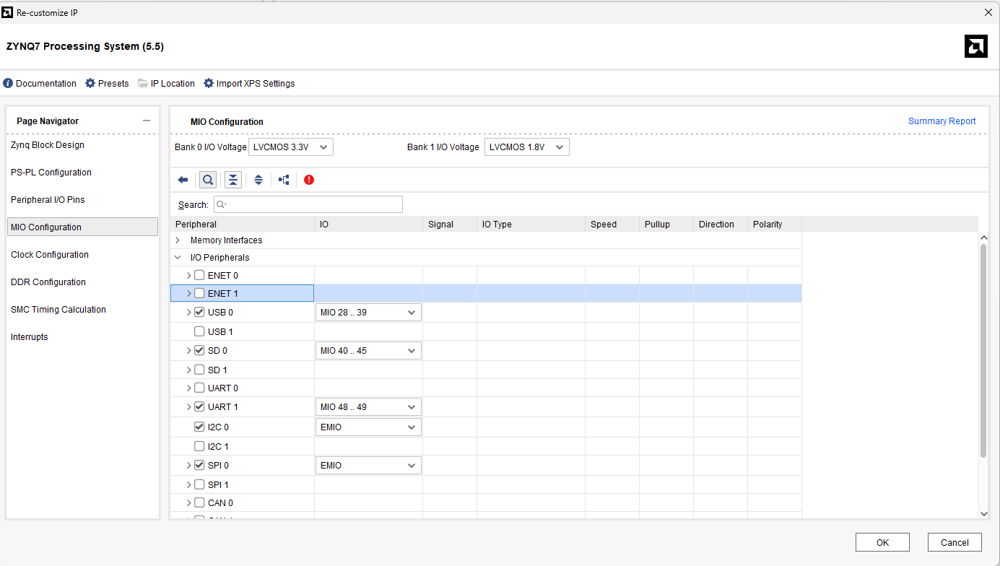

**DDR Configuration:**

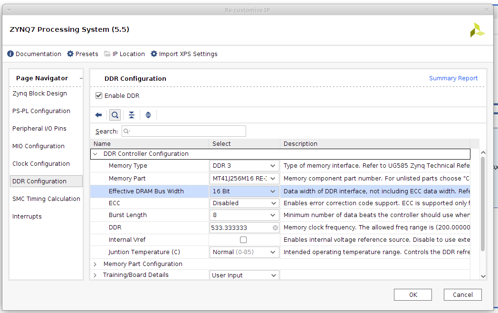

> Memory part **MT41J256M16 RE-125** in **16-bit mode**
---
<div style="page-break-after: always;"></div>

### 4.4 Generate Bitstream and Export XSA

1. **Validate Design** → should pass with no errors
2. **Generate Output Products** → Global
3. **Create HDL Wrapper** → let Vivado manage it
4. **Generate Bitstream** → wait for synthesis + implementation + bitstream generation

5. **File → Export → Export Hardware**
   - **Include bitstream**
   - Save as `zynq_mini.xsa`

> **Important:** The XSA (Xilinx Support Archive) contains the hardware description, address map, PS configuration parameters, and the FPGA bitstream. PetaLinux uses this file to generate the FSBL and configure U-Boot.

---

## 5. Host Environment Setup

### 5.1 Install Dependencies

```bash
sudo apt update
sudo apt install -y \
  gawk wget git diffstat unzip texinfo gcc build-essential \
  chrpath socat cpio python3 python3-pip python3-pexpect \
  xz-utils debianutils iputils-ping python3-git python3-jinja2 \
  python3-subunit zstd liblz4-tool file locales \
  libncurses-dev libncurses-dev libssl-dev libelf-dev \
  bc lz4 u-boot-tools net-tools rsync xterm autoconf \
  libtool automake screen pax gzip tar iproute2 \
  lib32z1 lib32stdc++6 \
  tftpd-hpa gnupg flex bison \
  dnsutils \
  parted dosfstools e2fsprogs \
  libtinfo5
```

### 5.2 Set Locale

```bash
sudo locale-gen en_US.UTF-8
export LANG=en_US.UTF-8
```

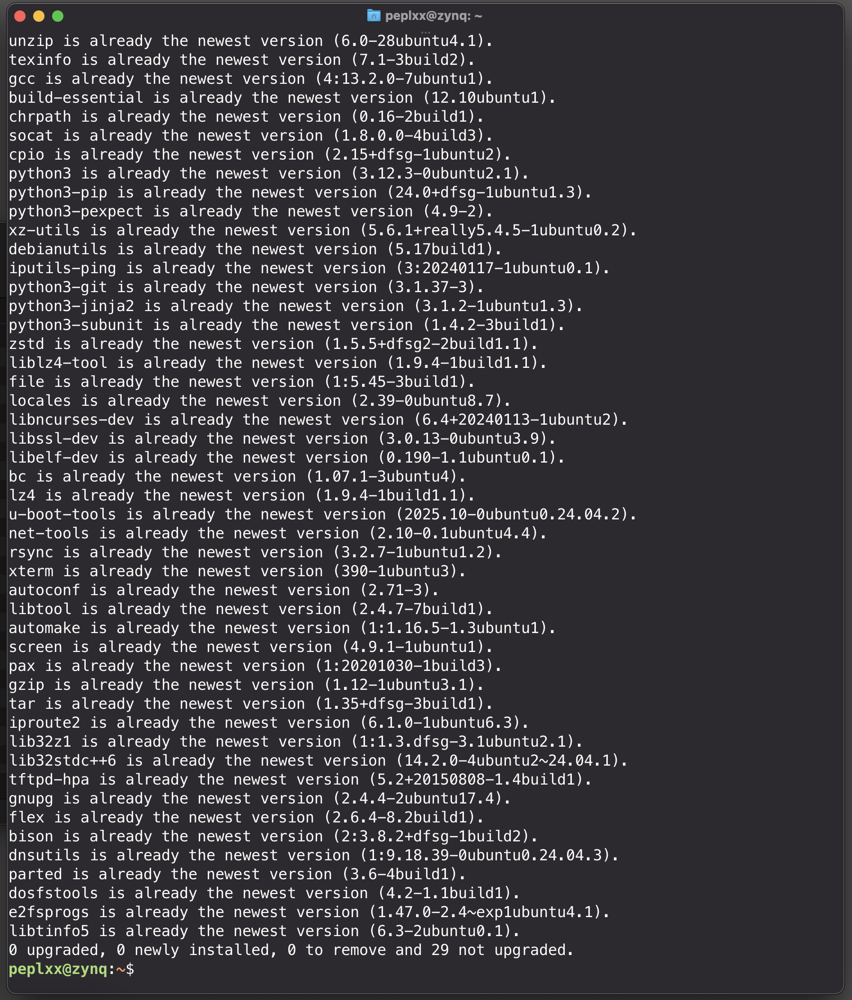

### 5.3 OrbStack-specific Notes

OrbStack masks `systemd-binfmt.service`, which produces a warning during PetaLinux install. This is cosmetic — `binfmt_misc` is already functional:

```bash
ls /proc/sys/fs/binfmt_misc/ # Shows qemu-arm entries — everything works
```

---

## 6. PetaLinux Installation

```bash
chmod +x petalinux-v2025.2-11160223-installer.run

mkdir -p ~/petalinux/2025.2

./petalinux-v2025.2-11160223-installer.run -d ~/petalinux/2025.2

source ~/petalinux/2025.2/settings.sh

# Verify installation
echo $PETALINUX
petalinux-create --help
```

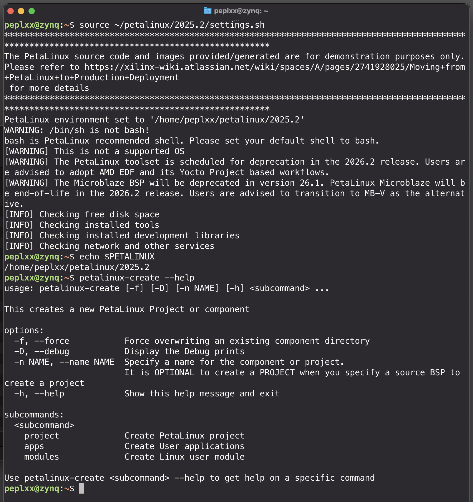

---

## 7. Unpack sstate Cache

The sstate (shared state) cache contains pre-compiled build artifacts from Xilinx. Using it reduces build time from hours to minutes by skipping recompilation of unchanged packages.

```bash
mkdir -p ~/sstate-cache

# Extract archive
tar xzf sstate_arm_2025.2.tar.gz -C ~/sstate-cache/
```

---

## 8. PetaLinux Project Configuration

### 8.1 Create Project

```bash
source ~/petalinux/2025.2/settings.sh

# Create from Zynq template
petalinux-create --type project --template zynq --name zynq_mini
cd zynq_mini/
```

### 8.2 Import Hardware Description

```bash
petalinux-config --get-hw-description=<path-to-xsa-directory>/
```

### 8.3 System Configuration

```bash
petalinux-config
```
<div style="page-break-after: always;"></div>

The following settings were configured:

**Serial Settings:**

```
Subsystem AUTO Hardware Settings --->
  Serial Settings --->
    Primary stdin/stdout ---> ps7_uart_1
```

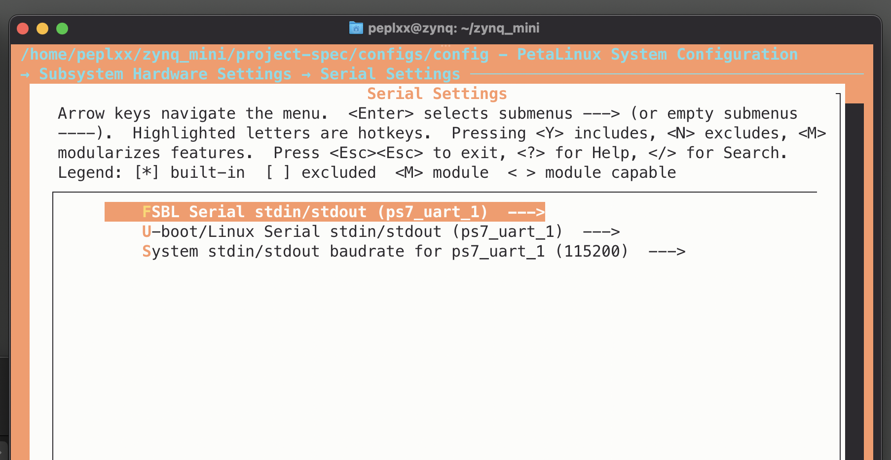

**Root Filesystem Type:**

```
Image Packaging Configuration --->
  Root filesystem type ---> SD card
```

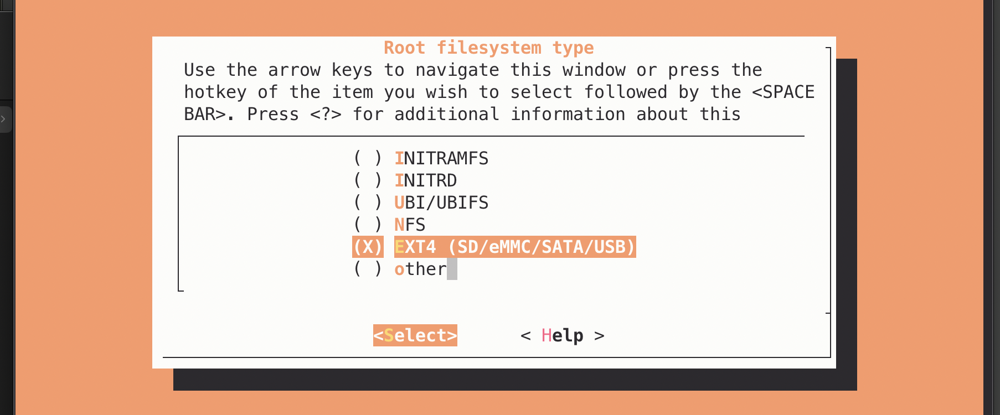

**sstate Cache URL:**

```
Yocto Settings --->
  Local sstate feeds settings --->
    local sstate feeds url ---> /home/peplxx/sstate-cache/arm
```

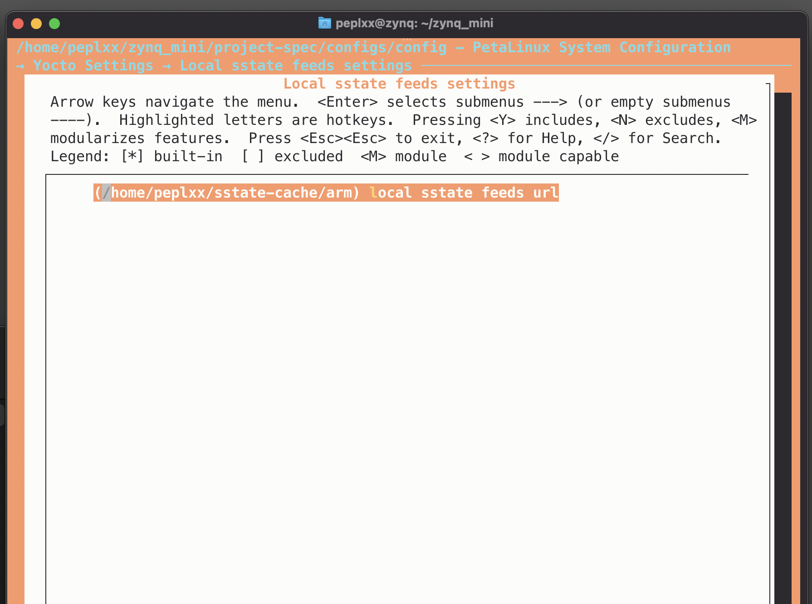

> **Important:** The sstate URL in PetaLinux config must point to the exact subdirectory containing the sstate files, e.g., `/home/peplxx/sstate-cache/arm` — not just `/home/peplxx/sstate-cache/`.

Save and exit.

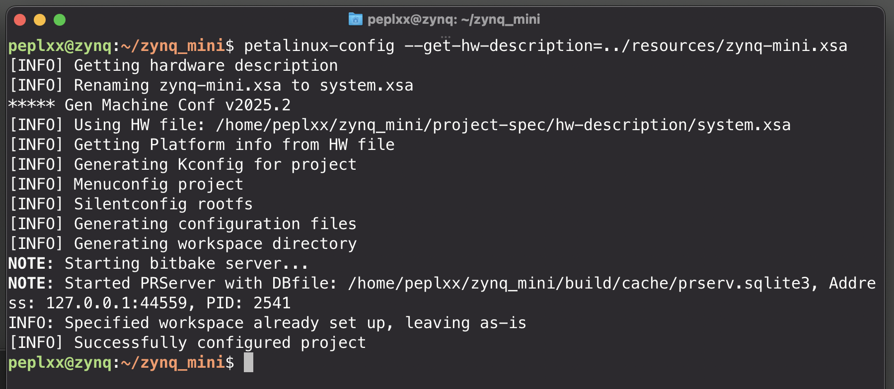

## 9. PetaLinux Rootfs Configuration

```bash
petalinux-config -c rootfs
```
Packages and init manager were configured as needed:

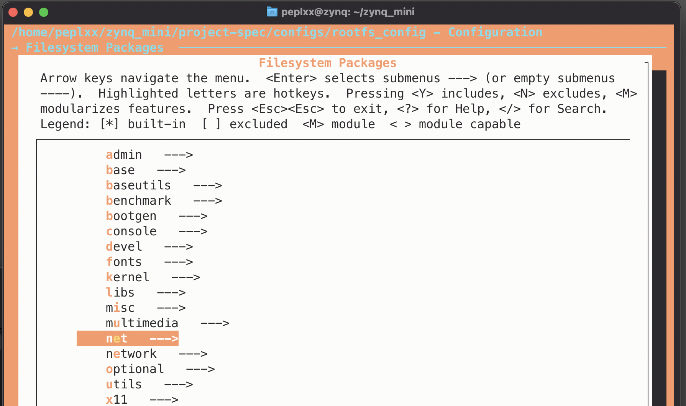

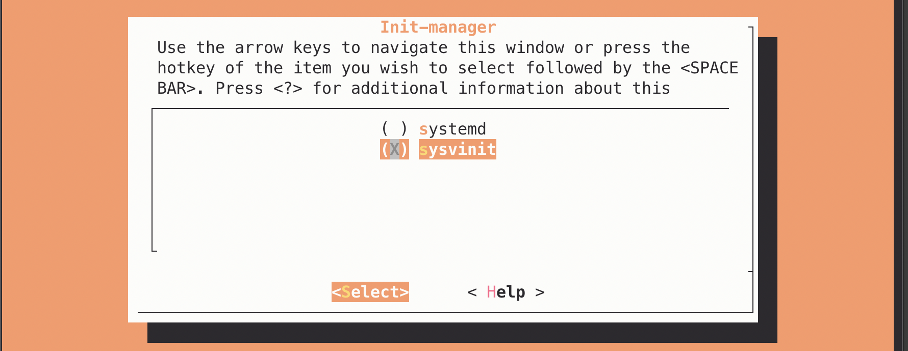

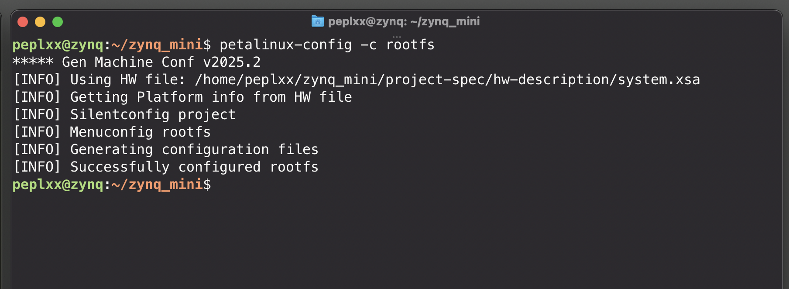

---

## 10. PetaLinux Device Tree Overlay

To suppress Ethernet PHY errors (no PHY chip is connected on this board), both GEM controllers are disabled in the device tree:

```bash
cat > project-spec/meta-user/recipes-bsp/device-tree/files/system-user.dtsi << 'EOF'
/include/ "system-conf.dtsi"
/ {
};

&gem0 {
    status = "disabled";
};

&gem1 {
    status = "disabled";
};
EOF
```

> **Why this is needed:** Without this fix, the kernel continuously prints `Could not attach PHY (-22)` and `udhcpc: read error: Network is down` messages, making the console unusable. These messages are caused by the Ethernet MAC (GEM) attempting to communicate with a PHY chip that does not exist on this board.

---
<div style="page-break-after: always;"></div>

## 11. PetaLinux Build

```bash
petalinux-build
```

The build system (Yocto/BitBake) compiles the following components:

- **FSBL** (First Stage Boot Loader) — generated from .xsa hardware parameters
- **U-Boot** — configured for Zynq with SD card boot
- **Linux Kernel** — ARM 32-bit, with Zynq device tree
- **Root filesystem** — BusyBox-based minimal Linux userspace
- **Device tree blob** — hardware description for the kernel

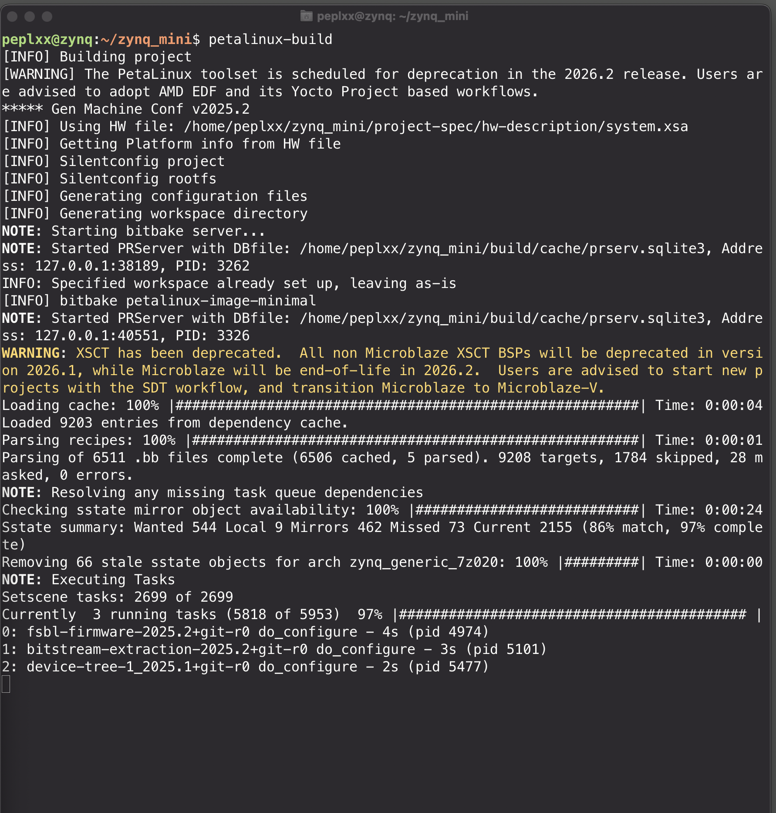

---
<div style="page-break-after: always;"></div>

## 12. PetaLinux Packaging

### 12.1 Copy Bitstream (if missing)

```bash
# If system.bit is not present in images/linux/:
cp ~/resources/system.bit ~/zynq_mini/images/linux/system.bit
```

### 12.2 Generate BOOT.BIN

BOOT.BIN is a composite binary containing FSBL + FPGA bitstream + U-Boot, packaged in Xilinx boot format:

```bash
petalinux-package --boot \
  --fsbl images/linux/zynq_fsbl.elf \
  --fpga images/linux/system.bit \
  --u-boot \
  --force
```

### 12.3 Verify Artifacts

```bash
ls -lh images/linux/BOOT.BIN
ls -lh images/linux/image.ub
ls -lh images/linux/boot.scr
ls -lh images/linux/rootfs.tar.gz
```

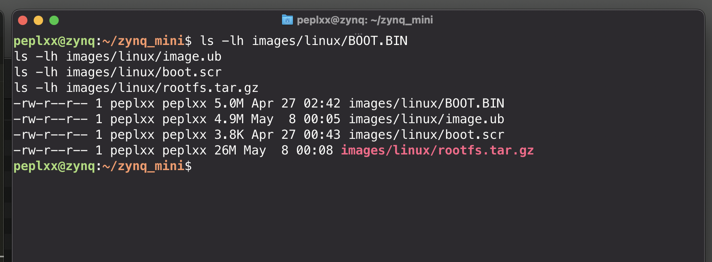

---
<div style="page-break-after: always;"></div>

## 13. SD Card Image Preparation

A custom script `prepare_sd_image.sh` was written to automate SD card image creation. It performs the following steps:

1. Creates an 8 GB raw image file
2. Partitions it (512 MB FAT32 + remaining EXT4)
3. Formats both partitions
4. Copies BOOT.BIN, image.ub, boot.scr to the FAT32 partition
5. Extracts rootfs.tar.gz to the EXT4 partition

```bash
sudo ./prepare_sd_image.sh images/linux sd_card.img
```

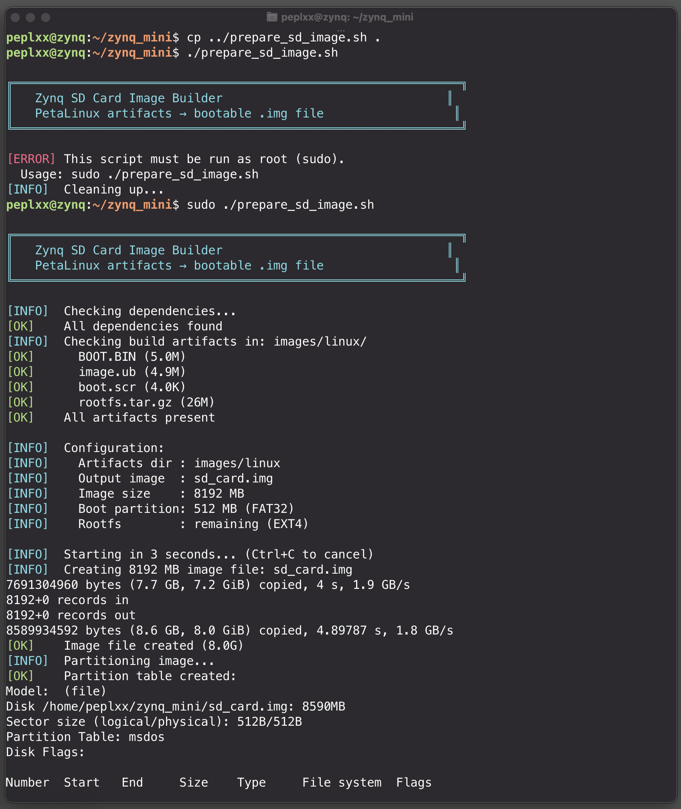

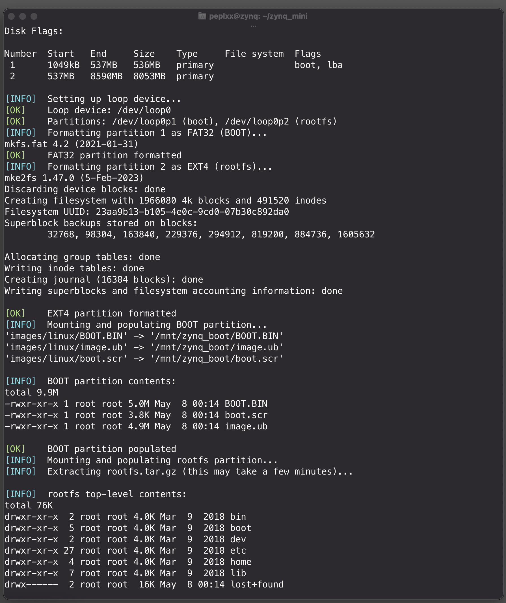

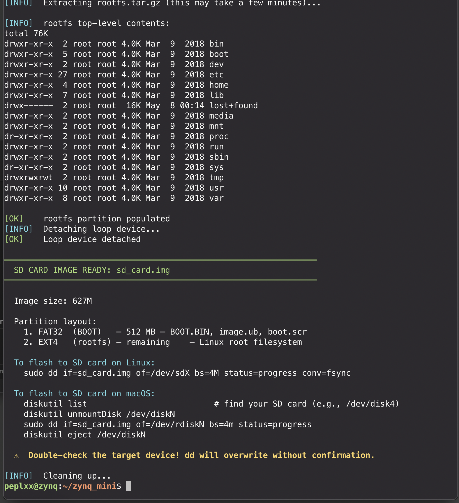


---
<div style="page-break-after: always;"></div>

## 14. Burning SD Card

The image file is transferred to the macOS host and burned to a physical SD card:

```bash
# On macOS:
diskutil list                        # identify SD card (e.g., /dev/disk4)
diskutil unmountDisk /dev/disk4
sudo dd if=sd_card.img of=/dev/rdisk4 bs=4m status=progress
diskutil eject /dev/disk4
```

> **Note:** `/dev/rdiskN` (raw disk) is used instead of `/dev/diskN` for significantly faster write speeds on macOS.

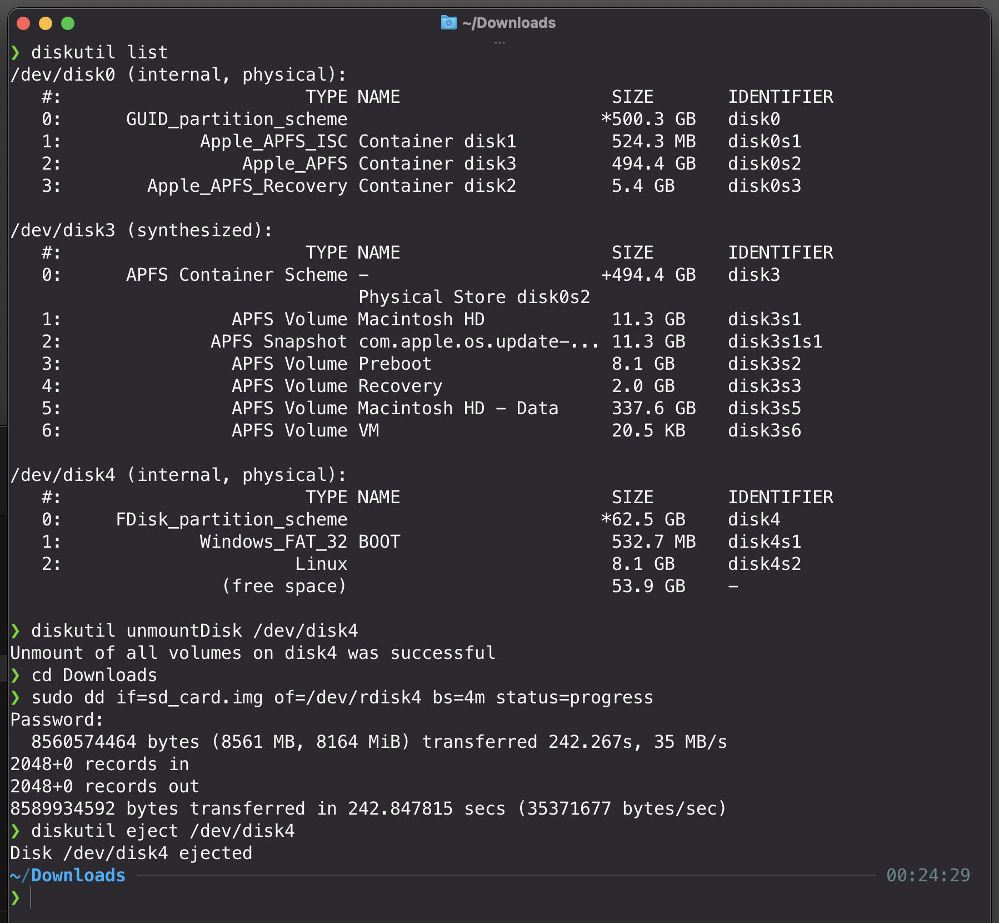

---
<div style="page-break-after: always;"></div>

## 15. Connecting via UART (picocom)

### 15.1 Hardware Connection

The board uses a CH340 USB-to-Serial converter. The USB cable is connected to the UART port on the board and to the macOS host.

### 15.2 Find Serial Port

```bash
ls /dev/cu.usbserial*
# Example output: /dev/cu.usbserial-210
```

### 15.3 Connect with picocom

```bash
brew install picocom    # install on macOS if not present

picocom -b 115200 --flow none /dev/cu.usbserial-210
```

| Parameter | Value |
|-----------|-------|
| Baud rate | 115200 |
| Data bits | 8 |
| Parity | None |
| Stop bits | 1 |
| Flow control | **None** (critical for CH340) |

**picocom keyboard shortcuts:**
- `Ctrl-A Ctrl-X` — exit picocom
- `Ctrl-A Ctrl-H` — show help
- `Ctrl-A Ctrl-V` — show current port settings

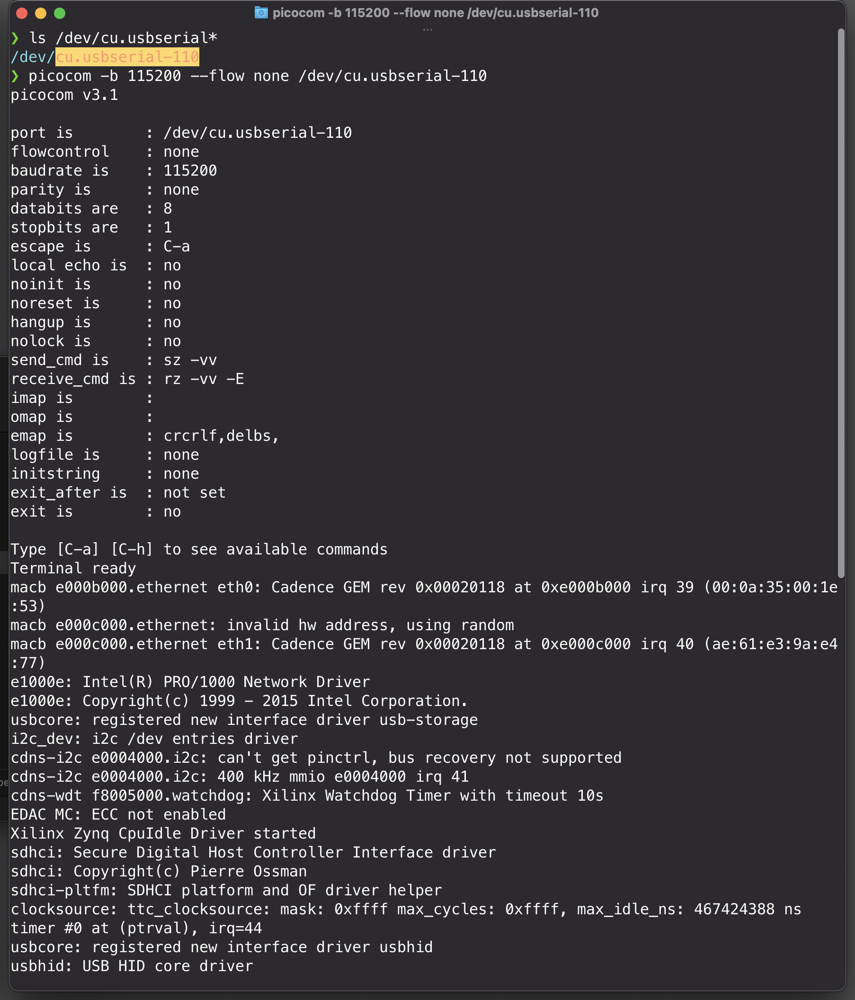

---

## 16. Boot Result & Login

After inserting the SD card, setting boot mode to SD, and powering on the board:

### 16.1 Boot Log

The full boot sequence was observed on UART:

1. **FSBL** initialized DDR, programmed FPGA bitstream
2. **U-Boot** loaded image.ub and boot.scr from FAT32 partition
3. **Linux Kernel** decompressed, detected SD card (`mmcblk0: p1 p2`)
4. **rootfs** mounted from `/dev/mmcblk0p2` (ext4)
5. **SysVinit** entered runlevel 5
6. **Login prompt** appeared

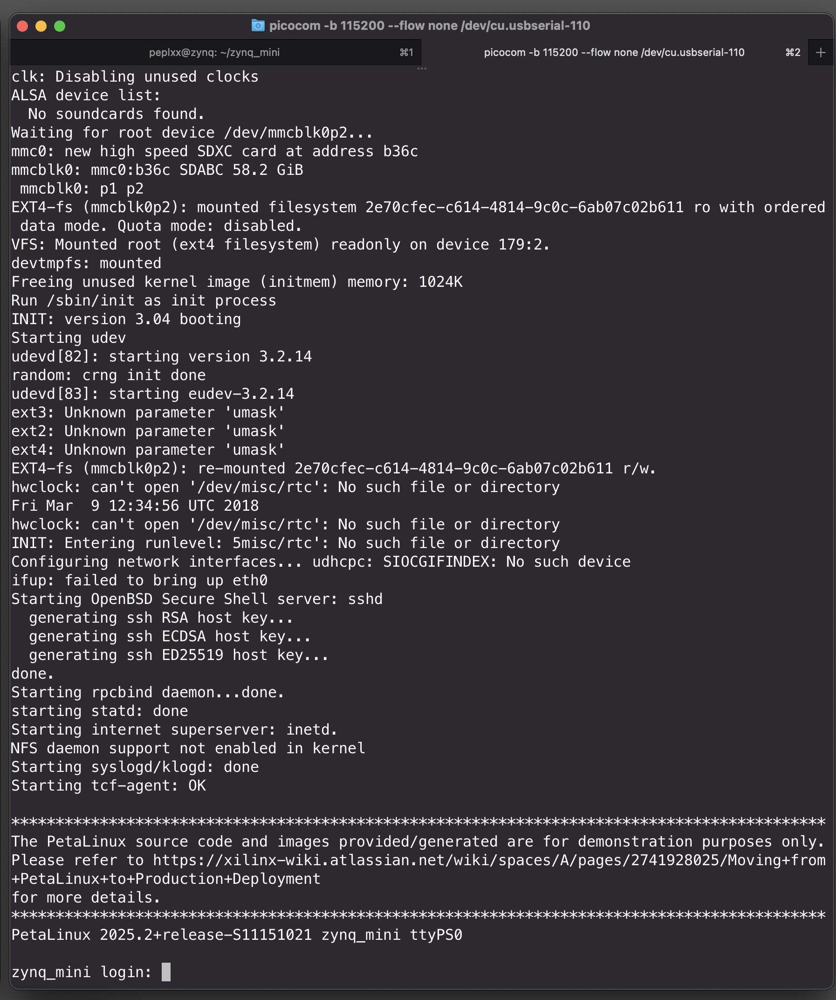

### 16.2 Login

```
PetaLinux 2025.2+release-S11151021 zynq_mini ttyPS0

zynq_mini login: petalinux
Password: petalinux

You are required to change your password immediately (administrator enforced).
New password: <new-password>
Retype new password: <new-password>

petalinux@zynq_mini:~$
```

**Default credentials:** `petalinux` / `petalinux` (password change is required on first login).

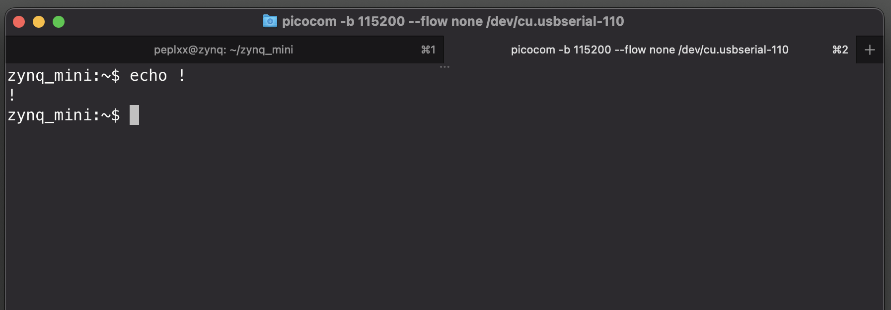

---
<div style="page-break-after: always;"></div>

## 17. Troubleshooting

Issues encountered during the lab and their solutions:

| # | Issue | Cause | Solution |
|---|-------|-------|----------|
| 1 | `systemd-binfmt.service is masked` | OrbStack VM limitation | Cosmetic — binfmt_misc already works |
| 2 | `libtinfo.so.5 required` | PetaLinux needs older ncurses | `apt install libtinfo5` |
| 3 | UART shows nothing | Flow control enabled / wrong port | Use `--flow none` in picocom |
| 4 | Ethernet PHY errors flooding console | No PHY chip on board, GEM enabled | Disable `&gem0` and `&gem1` in device tree |
| 5 | `root` login incorrect | PetaLinux 2025.2 disables root login | Use `petalinux` / `petalinux` credentials |
| 6 | `nslookup required` build error | Missing dnsutils package | `apt install dnsutils` |
| 7 | sstate cache only 75% match | Wrong path in config | Point to `~/sstate-cache/arm` subdirectory |

---

## 18. Conclusion

This lab successfully demonstrated the complete embedded Linux boot flow on a Zynq-7000 FPGA board:

1. **Hardware description** was created in Vivado with correct DDR (MT41J256M16 RE-125, 16-bit), MIO, and UART configuration
2. **PetaLinux** built all software components: FSBL, U-Boot, Linux kernel, device tree, and root filesystem
3. **SD card image** was prepared using a custom automation script (`prepare_sd_image.sh`)
4. **The board booted** through the full chain: BootROM → FSBL → U-Boot → Kernel → initramfs → rootfs
5. **Interactive login** was achieved over UART serial console using picocom

The boot flow satisfies the lab requirement: **bootloader → initramfs → rootfs**.

---
<div style="page-break-after: always;"></div>

## 19. Appendix: prepare_sd_image.sh

```bash
#!/bin/bash
#
# prepare_sd_image.sh
# Creates a complete SD card image from PetaLinux build artifacts
# Usage: ./prepare_sd_image.sh [petalinux_images_dir] [output_image]
#

set -euo pipefail

# ─── Configuration ───────────────────────────────────────────────────────────
IMAGES_DIR="${1:-images/linux}"
OUTPUT_IMAGE="${2:-sd_card.img}"
IMAGE_SIZE_MB=8192
BOOT_SIZE_MB=512
BOOT_LABEL="BOOT"
ROOTFS_LABEL="rootfs"

# ─── Color helpers ───────────────────────────────────────────────────────────
RED='\033[0;31m'
GREEN='\033[0;32m'
YELLOW='\033[1;33m'
CYAN='\033[0;36m'
NC='\033[0m'

info()  { echo -e "${CYAN}[INFO]${NC}  $*"; }
ok()    { echo -e "${GREEN}[OK]${NC}    $*"; }
warn()  { echo -e "${YELLOW}[WARN]${NC}  $*"; }
error() { echo -e "${RED}[ERROR]${NC} $*"; exit 1; }

# ─── Prerequisite checks ────────────────────────────────────────────────────
check_deps() {
    info "Checking dependencies..."
    local missing=()
    for cmd in dd parted mkfs.vfat mkfs.ext4 losetup mount umount tar sync; do
        if ! command -v "$cmd" &>/dev/null; then
            missing+=("$cmd")
        fi
    done
    if [ ${#missing[@]} -ne 0 ]; then
        error "Missing tools: ${missing[*]}\n  Install: sudo apt install -y parted dosfstools e2fsprogs"
    fi
    ok "All dependencies found"
}

check_artifacts() {
    info "Checking build artifacts in: ${IMAGES_DIR}/"
    local required=(BOOT.BIN image.ub boot.scr rootfs.tar.gz)
    local all_found=true
    for f in "${required[@]}"; do
        if [ -f "${IMAGES_DIR}/${f}" ]; then
            local size
            size=$(du -h "${IMAGES_DIR}/${f}" | cut -f1)
            ok "  ${f} (${size})"
        else
            warn "  ${f} — NOT FOUND"
            all_found=false
        fi
    done
    if [ "$all_found" = false ]; then
        error "Missing required artifacts. Run petalinux-build and petalinux-package first."
    fi
    ok "All artifacts present"
}

check_root() {
    if [ "$(id -u)" -ne 0 ]; then
        error "This script must be run as root (sudo).\n  Usage: sudo $0 $*"
    fi
}

# ─── Cleanup handler ────────────────────────────────────────────────────────
LOOP_DEV=""
BOOT_MOUNTED=false
ROOTFS_MOUNTED=false

cleanup() {
    info "Cleaning up..."
    if [ "$BOOT_MOUNTED" = true ]; then
        umount /mnt/zynq_boot 2>/dev/null || true
    fi
    if [ "$ROOTFS_MOUNTED" = true ]; then
        umount /mnt/zynq_rootfs 2>/dev/null || true
    fi
    if [ -n "$LOOP_DEV" ]; then
        losetup -d "$LOOP_DEV" 2>/dev/null || true
    fi
    rmdir /mnt/zynq_boot 2>/dev/null || true
    rmdir /mnt/zynq_rootfs 2>/dev/null || true
}
trap cleanup EXIT

# ─── Step 1: Create empty image file ────────────────────────────────────────
create_image() {
    info "Creating ${IMAGE_SIZE_MB} MB image file: ${OUTPUT_IMAGE}"
    dd if=/dev/zero of="${OUTPUT_IMAGE}" bs=1M count="${IMAGE_SIZE_MB}" status=progress
    ok "Image file created ($(du -h "${OUTPUT_IMAGE}" | cut -f1))"
}

# ─── Step 2: Partition the image ────────────────────────────────────────────
partition_image() {
    info "Partitioning image..."
    parted -s "${OUTPUT_IMAGE}" \
        mklabel msdos \
        mkpart primary fat32 1MiB "${BOOT_SIZE_MB}MiB" \
        mkpart primary ext4 "${BOOT_SIZE_MB}MiB" 100% \
        set 1 boot on
    ok "Partition table created:"
    parted -s "${OUTPUT_IMAGE}" print
}

# ─── Step 3: Setup loop device ──────────────────────────────────────────────
setup_loop() {
    info "Setting up loop device..."
    LOOP_DEV=$(losetup --find --show --partscan "${OUTPUT_IMAGE}")
    ok "Loop device: ${LOOP_DEV}"
    sleep 2
    partprobe "${LOOP_DEV}" 2>/dev/null || true
    sleep 1
    if [ ! -b "${LOOP_DEV}p1" ] || [ ! -b "${LOOP_DEV}p2" ]; then
        error "Partition devices not found. Expected ${LOOP_DEV}p1 and ${LOOP_DEV}p2"
    fi
    ok "Partitions: ${LOOP_DEV}p1 (boot), ${LOOP_DEV}p2 (rootfs)"
}

# ─── Step 4: Format partitions ──────────────────────────────────────────────
format_partitions() {
    info "Formatting partition 1 as FAT32 (${BOOT_LABEL})..."
    mkfs.vfat -F 32 -n "${BOOT_LABEL}" "${LOOP_DEV}p1"
    ok "FAT32 partition formatted"
    info "Formatting partition 2 as EXT4 (${ROOTFS_LABEL})..."
    mkfs.ext4 -L "${ROOTFS_LABEL}" -F "${LOOP_DEV}p2"
    ok "EXT4 partition formatted"
}

# ─── Step 5: Mount and populate BOOT partition ──────────────────────────────
populate_boot() {
    info "Mounting and populating BOOT partition..."
    mkdir -p /mnt/zynq_boot
    mount "${LOOP_DEV}p1" /mnt/zynq_boot
    BOOT_MOUNTED=true
    cp -v "${IMAGES_DIR}/BOOT.BIN"  /mnt/zynq_boot/
    cp -v "${IMAGES_DIR}/image.ub"  /mnt/zynq_boot/
    cp -v "${IMAGES_DIR}/boot.scr"  /mnt/zynq_boot/
    if [ -f "${IMAGES_DIR}/uEnv.txt" ]; then
        cp -v "${IMAGES_DIR}/uEnv.txt" /mnt/zynq_boot/
    fi
    echo ""
    info "BOOT partition contents:"
    ls -lh /mnt/zynq_boot/
    echo ""
    sync
    umount /mnt/zynq_boot
    BOOT_MOUNTED=false
    ok "BOOT partition populated"
}

# ─── Step 6: Mount and populate rootfs partition ────────────────────────────
populate_rootfs() {
    info "Mounting and populating rootfs partition..."
    mkdir -p /mnt/zynq_rootfs
    mount "${LOOP_DEV}p2" /mnt/zynq_rootfs
    ROOTFS_MOUNTED=true
    info "Extracting rootfs.tar.gz (this may take a few minutes)..."
    tar xzf "${IMAGES_DIR}/rootfs.tar.gz" -C /mnt/zynq_rootfs/
    echo ""
    info "rootfs top-level contents:"
    ls -lh /mnt/zynq_rootfs/
    echo ""
    sync
    umount /mnt/zynq_rootfs
    ROOTFS_MOUNTED=false
    ok "rootfs partition populated"
}

# ─── Step 7: Detach loop device ─────────────────────────────────────────────
detach_loop() {
    info "Detaching loop device..."
    losetup -d "${LOOP_DEV}"
    LOOP_DEV=""
    ok "Loop device detached"
}

# ─── Step 8: Print summary ──────────────────────────────────────────────────
print_summary() {
    echo ""
    echo -e "${GREEN}════════════════════════════════════════════════════════════════${NC}"
    echo -e "${GREEN}  SD CARD IMAGE READY: ${OUTPUT_IMAGE}${NC}"
    echo -e "${GREEN}════════════════════════════════════════════════════════════════${NC}"
    echo ""
    echo "  Image size: $(du -h "${OUTPUT_IMAGE}" | cut -f1)"
    echo ""
    echo "  Partition layout:"
    echo "    1. FAT32  (${BOOT_LABEL})   — ${BOOT_SIZE_MB} MB — BOOT.BIN, image.ub, boot.scr"
    echo "    2. EXT4   (${ROOTFS_LABEL}) — remaining    — Linux root filesystem"
    echo ""
    echo -e "  ${CYAN}To flash to SD card on Linux:${NC}"
    echo "    sudo dd if=${OUTPUT_IMAGE} of=/dev/sdX bs=4M status=progress conv=fsync"
    echo ""
    echo -e "  ${CYAN}To flash to SD card on macOS:${NC}"
    echo "    diskutil list"
    echo "    diskutil unmountDisk /dev/diskN"
    echo "    sudo dd if=${OUTPUT_IMAGE} of=/dev/rdiskN bs=4m status=progress"
    echo "    diskutil eject /dev/diskN"
    echo ""
    echo -e "  ${YELLOW}⚠  Double-check the target device! dd overwrites without confirmation.${NC}"
    echo ""
}

# ─── Main ────────────────────────────────────────────────────────────────────
main() {
    echo ""
    echo -e "${CYAN}╔══════════════════════════════════════════════════════════════╗${NC}"
    echo -e "${CYAN}║   Zynq SD Card Image Builder                               ║${NC}"
    echo -e "${CYAN}║   PetaLinux artifacts → bootable .img file                  ║${NC}"
    echo -e "${CYAN}╚══════════════════════════════════════════════════════════════╝${NC}"
    echo ""
    check_root
    check_deps
    check_artifacts
    echo ""
    info "Configuration:"
    info "  Artifacts dir : ${IMAGES_DIR}"
    info "  Output image  : ${OUTPUT_IMAGE}"
    info "  Image size    : ${IMAGE_SIZE_MB} MB"
    info "  Boot partition: ${BOOT_SIZE_MB} MB (FAT32)"
    info "  Rootfs        : remaining (EXT4)"
    echo ""
    info "Starting in 3 seconds... (Ctrl+C to cancel)"
    sleep 3
    create_image
    partition_image
    setup_loop
    format_partitions
    populate_boot
    populate_rootfs
    detach_loop
    print_summary
}

main "$@"
```
