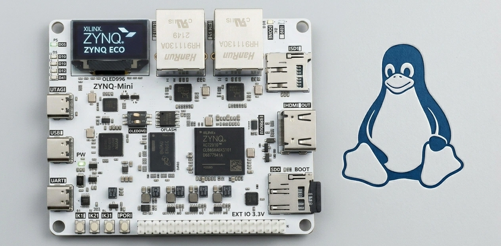
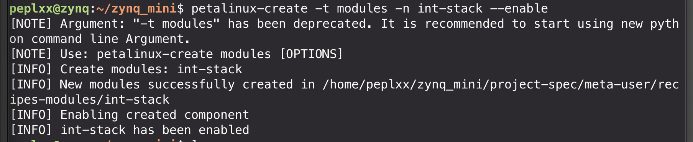
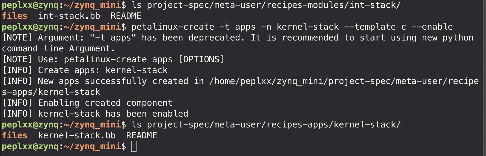
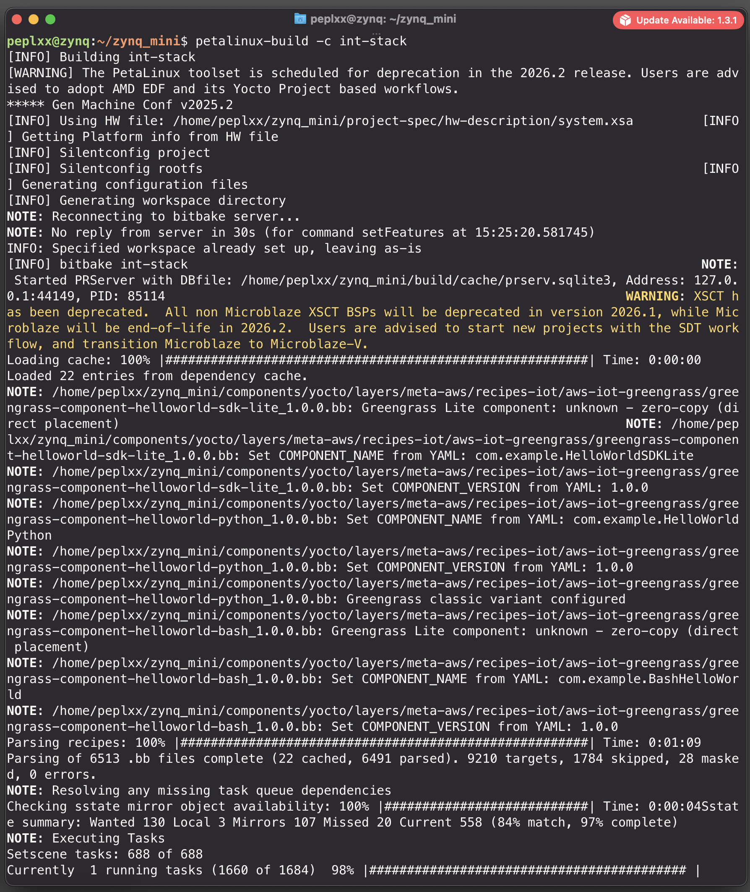
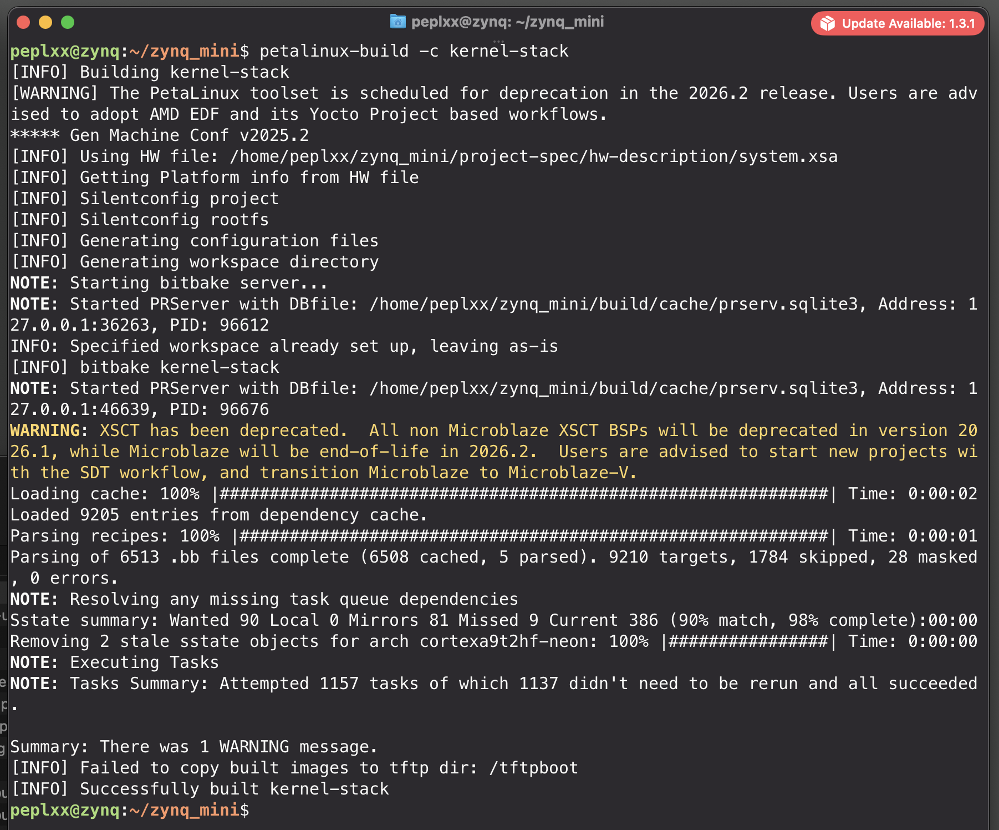
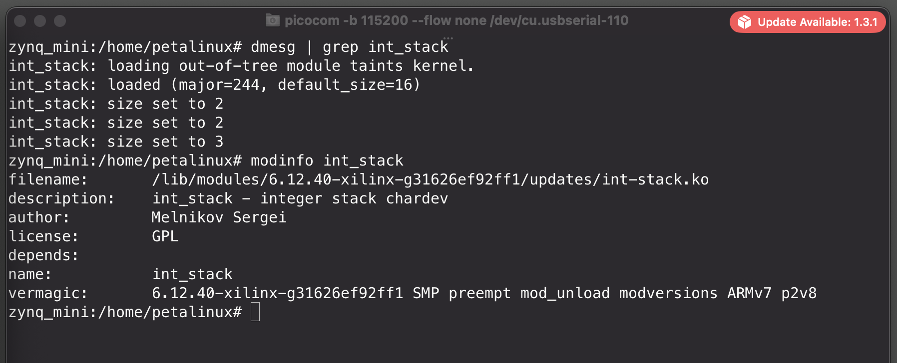
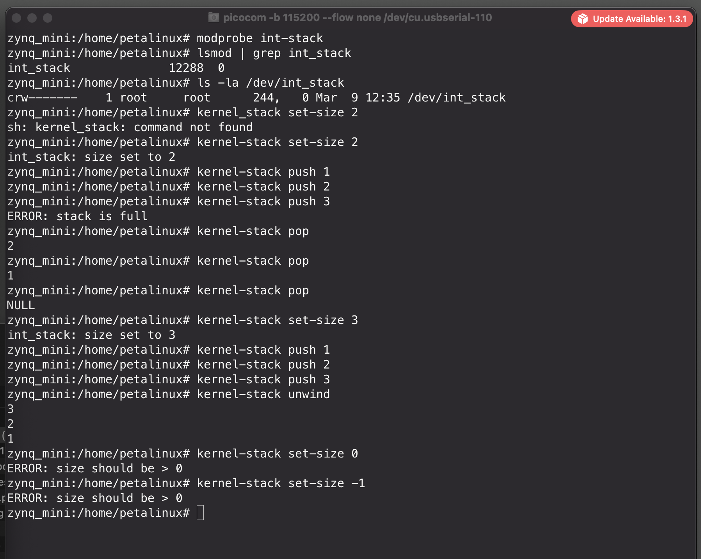

# Lab 04: Kernel Modules — Integer Stack Character Device



**Student:** Melnikov Sergei

**Target:** ZYNQ MINI (XC7Z020-2CLG400I)

**Tools:** PetaLinux 2025.2, OrbStack x86 VM (Ubuntu), macOS

---

## Table of Contents

1. [Overview](#1-overview)
2. [Architecture & Design](#2-architecture--design)
3. [PetaLinux Module & App Creation](#3-petalinux-module--app-creation)
4. [Shared IOCTL Header](#4-shared-ioctl-header)
5. [Kernel Module Implementation](#5-kernel-module-implementation)
6. [Userspace CLI Utility Implementation](#6-userspace-cli-utility-implementation)
7. [BitBake Recipes](#7-bitbake-recipes)
8. [Building](#8-building)
9. [Deployment & Testing on Zynq](#9-deployment--testing-on-zynq)
10. [Synchronization Design](#10-synchronization-design)
11. [Error Handling Matrix](#11-error-handling-matrix)
12. [Troubleshooting](#12-troubleshooting)
13. [Conclusion](#13-conclusion)
14. [Appendix: Full Source Code](#14-appendix-full-source-code)

<div style="page-break-after: always;"></div>

## 1. Overview

The goal of this lab is to implement a character device kernel module `int_stack.ko` that exposes an integer stack data structure via `/dev/int_stack`, supporting:

- **push** — via `write()` file operation
- **pop** — via `read()` file operation
- **set max size** — via `ioctl()` file operation
- **Thread-safe access** — readers-writers synchronization (rwlock + mutex)
- **Dynamic memory allocation** — resizable backing array via `kmalloc_array`/`kfree`

A userspace CLI utility `kernel-stack` wraps the device operations into human-friendly commands.

---

## 2. Architecture & Design

```
┌─────────────────────────────────────────────────────────┐
│                     User Space                          │
│                                                         │
│  kernel-stack push 42    ──→  write(fd, &42, 4)         │
│  kernel-stack pop        ──→  read(fd, &val, 4)         │
│  kernel-stack set-size 8 ──→  ioctl(fd, SET_SIZE, &8)   │
│  kernel-stack unwind     ──→  read() in loop            │
│                                                         │
└──────────────────────┬──────────────────────────────────┘
                       │  /dev/int_stack
                       ▼
┌─────────────────────────────────────────────────────────┐
│                    Kernel Space                         │
│                                                         │
│  int-stack.ko (character device module)                 │
│                                                         │
│  ┌───────────────────────────────────────────────────┐  │
│  │  struct int_stack {                               │  │
│  │      int *data;          ← kmalloc_array()        │  │
│  │      int  top;           ← index (-1 = empty)     │  │
│  │      int  max_size;      ← configurable via ioctl │  │
│  │      rwlock_t lock;      ← readers-writers lock   │  │
│  │      struct mutex resize_mutex; ← resize guard    │  │
│  │  }                                                │  │
│  └───────────────────────────────────────────────────┘  │
│                                                         │
│  file_operations:                                       │
│    .open    → allow access                              │
│    .release → close                                     │
│    .read    → pop  (returns 0 if empty = NULL)          │
│    .write   → push (returns -ERANGE if full)            │
│    .ioctl   → set max_size (returns -EINVAL if ≤ 0)    │
└─────────────────────────────────────────────────────────┘
```
<div style="page-break-after: always;"></div>

### PetaLinux Module Template

The `petalinux-create -t modules` command generates a complete build scaffolding: the BitBake recipe (`.bb`), the kbuild `Makefile`, directory structure, and license file — everything needed for Yocto/BitBake to cross-compile and package a kernel module into the root filesystem. The generated C source (`@modname@.c`) was replaced with our chardev implementation, while the build infrastructure was reused as-is.
<div style="page-break-after: always;"></div>


## 3. PetaLinux Module & App Creation

### 3.1 Create Module Skeleton

```bash
source ~/petalinux/2025.2/settings.sh
cd ~/zynq_mini/

# Create kernel module recipe
petalinux-create -t modules -n int-stack --enable
```



### 3.2 Create Userspace App Skeleton

```bash
# Create userspace application recipe
petalinux-create -t apps -n kernel-stack --template c --enable
```



<div style="page-break-after: always;"></div>
### 3.3 Resulting Project Structure

```
project-spec/meta-user/
├── recipes-modules/int-stack/
│   ├── files/
│   │   ├── int-stack.c            ← kernel module source
│   │   ├── int_stack_ioctl.h      ← shared ioctl definitions
│   │   ├── Makefile               ← kbuild Makefile
│   │   └── COPYING                ← GPL-2.0 license
│   └── int-stack.bb               ← BitBake recipe
└── recipes-apps/kernel-stack/
    ├── files/
    │   ├── kernel_stack.c         ← userspace CLI source
    │   ├── int_stack_ioctl.h      ← shared ioctl definitions (copy)
    │   └── Makefile               ← userspace Makefile
    └── kernel-stack.bb            ← BitBake recipe
```

---
<div style="page-break-after: always;"></div>

## 4. Shared IOCTL Header

This header is shared between the kernel module and the userspace utility. It defines the ioctl command number and device path.

**`int_stack_ioctl.h`:**

```c
#ifndef _INT_STACK_IOCTL_H
#define _INT_STACK_IOCTL_H

#ifdef __KERNEL__
#include <linux/ioctl.h>
#else
#include <sys/ioctl.h>
#endif

#define INT_STACK_IOC_MAGIC     'S'

/*
 * INT_STACK_IOC_SET_SIZE — set maximum stack capacity.
 * Argument: pointer to int (must be > 0).
 * Returns:
 *   0        on success
 *  -EINVAL   if size <= 0
 *  -EBUSY    if current element count exceeds new size
 *  -ENOMEM   if allocation fails
 */
#define INT_STACK_IOC_SET_SIZE  _IOW(INT_STACK_IOC_MAGIC, 1, int)

#define INT_STACK_DEVICE_PATH   "/dev/int_stack"

#endif /* _INT_STACK_IOCTL_H */
```

> **Note:** The `#ifdef __KERNEL__` guard ensures the header compiles correctly in both kernel space (using `<linux/ioctl.h>`) and user space (using `<sys/ioctl.h>`).

The header is placed in both `recipes-modules/int-stack/files/` and `recipes-apps/kernel-stack/files/` to avoid cross-recipe dependencies.

---

<div style="page-break-after: always;"></div>

## 5. Kernel Module Implementation

**`int-stack.c`:**

```c
/*  int-stack.c — Integer stack character device kernel module.
 *
 *  Implements a stack<integer> data structure accessible via /dev/int_stack.
 *  Supports push (write), pop (read), and max size configuration (ioctl).
 *  Thread-safe using rwlock (data access) + mutex (resize serialization).
 *
 *  Copyright (C) 2025 Melnikov Sergei
 *
 *  This program is free software; you can redistribute it and/or modify
 *  it under the terms of the GNU General Public License as published by
 *  the Free Software Foundation; either version 2 of the License, or
 *  (at your option) any later version.
 */

#include <linux/kernel.h>
#include <linux/init.h>
#include <linux/module.h>
#include <linux/fs.h>
#include <linux/cdev.h>
#include <linux/device.h>
#include <linux/slab.h>
#include <linux/uaccess.h>
#include <linux/mutex.h>
#include <linux/rwlock.h>
#include <linux/errno.h>

#include "int_stack_ioctl.h"

#define DEFAULT_MAX_SIZE 16
#define DEVICE_NAME      "int_stack"

MODULE_LICENSE("GPL");
MODULE_AUTHOR("Melnikov Sergei");
MODULE_DESCRIPTION("int_stack - integer stack chardev module (Lab 4)");

/* ═══════════════════════════════════════════════════════════════════════
 *  Stack Data Structure
 * ═══════════════════════════════════════════════════════════════════════ */

struct int_stack {
    int          *data;          /* dynamically allocated backing array */
    int           top;           /* index of top element; -1 = empty   */
    int           max_size;      /* current maximum capacity            */
    rwlock_t      lock;          /* readers-writers lock for data/top   */
    struct mutex  resize_mutex;  /* serializes ioctl resize operations  */
};

/* Single global stack instance (shared across all openers) */
static struct int_stack stack;

/* Character device infrastructure */
static dev_t            dev_num;
static struct cdev      stack_cdev;
static struct class    *stack_class;

/* ═══════════════════════════════════════════════════════════════════════
 *  file_operations: open / release
 * ═══════════════════════════════════════════════════════════════════════ */

static int stack_open(struct inode *inode, struct file *filp)
{
    return 0;
}

static int stack_release(struct inode *inode, struct file *filp)
{
    return 0;
}

/* ═══════════════════════════════════════════════════════════════════════
 *  file_operations: read → pop
 *
 *  Reads one integer from the top of the stack.
 *  Returns:
 *    sizeof(int) — success, one element popped
 *    0           — stack is empty (equivalent to NULL per stack(3))
 *   -EINVAL      — user buffer too small
 *   -EFAULT      — copy_to_user failed
 * ═══════════════════════════════════════════════════════════════════════ */

static ssize_t stack_read(struct file *filp, char __user *buf,
                          size_t count, loff_t *f_pos)
{
    int val;
    unsigned long flags;

    if (count < sizeof(int))
        return -EINVAL;

    write_lock_irqsave(&stack.lock, flags);

    if (stack.top < 0) {
        write_unlock_irqrestore(&stack.lock, flags);
        return 0; /* empty → NULL */
    }

    val = stack.data[stack.top];
    stack.top--;

    write_unlock_irqrestore(&stack.lock, flags);

    if (copy_to_user(buf, &val, sizeof(int)))
        return -EFAULT;

    return sizeof(int);
}

/* ═══════════════════════════════════════════════════════════════════════
 *  file_operations: write → push
 *
 *  Writes one integer onto the stack.
 *  Returns:
 *    sizeof(int) — success, element pushed
 *   -ERANGE      — stack is full (per stack(3) convention)
 *   -EINVAL      — user buffer too small
 *   -EFAULT      — copy_from_user failed
 * ═══════════════════════════════════════════════════════════════════════ */

static ssize_t stack_write(struct file *filp, const char __user *buf,
                           size_t count, loff_t *f_pos)
{
    int val;
    unsigned long flags;

    if (count < sizeof(int))
        return -EINVAL;

    if (copy_from_user(&val, buf, sizeof(int)))
        return -EFAULT;

    write_lock_irqsave(&stack.lock, flags);

    if (stack.top + 1 >= stack.max_size) {
        write_unlock_irqrestore(&stack.lock, flags);
        return -ERANGE;
    }

    stack.top++;
    stack.data[stack.top] = val;

    write_unlock_irqrestore(&stack.lock, flags);

    return sizeof(int);
}

/* ═══════════════════════════════════════════════════════════════════════
 *  file_operations: unlocked_ioctl → set max stack size
 *
 *  Command: INT_STACK_IOC_SET_SIZE
 *  Argument: pointer to int (new max size, must be > 0)
 *  Returns:
 *    0        — success
 *   -ENOTTY   — unknown ioctl command
 *   -EINVAL   — new_size <= 0
 *   -EBUSY    — current elements exceed new_size
 *   -ENOMEM   — kmalloc failed
 *   -EFAULT   — copy_from_user failed
 * ═══════════════════════════════════════════════════════════════════════ */

static long stack_ioctl(struct file *filp, unsigned int cmd,
                        unsigned long arg)
{
    int new_size;
    int *new_data;
    unsigned long flags;

    if (cmd != INT_STACK_IOC_SET_SIZE)
        return -ENOTTY;

    if (copy_from_user(&new_size, (int __user *)arg, sizeof(int)))
        return -EFAULT;

    if (new_size <= 0)
        return -EINVAL;

    /* Serialize concurrent resize operations */
    mutex_lock(&stack.resize_mutex);

    /* Allocate new backing array (outside spinlock — may sleep) */
    new_data = kmalloc_array(new_size, sizeof(int), GFP_KERNEL);
    if (!new_data) {
        mutex_unlock(&stack.resize_mutex);
        return -ENOMEM;
    }

    write_lock_irqsave(&stack.lock, flags);

    /* Refuse to shrink below current element count */
    if (stack.top + 1 > new_size) {
        write_unlock_irqrestore(&stack.lock, flags);
        kfree(new_data);
        mutex_unlock(&stack.resize_mutex);
        return -EBUSY;
    }

    /* Copy existing elements to new buffer */
    if (stack.top >= 0)
        memcpy(new_data, stack.data, (stack.top + 1) * sizeof(int));

    kfree(stack.data);
    stack.data = new_data;
    stack.max_size = new_size;

    write_unlock_irqrestore(&stack.lock, flags);
    mutex_unlock(&stack.resize_mutex);

    pr_info("int_stack: size set to %d\n", new_size);
    return 0;
}

static const struct file_operations stack_fops = {
    .owner          = THIS_MODULE,
    .open           = stack_open,
    .release        = stack_release,
    .read           = stack_read,
    .write          = stack_write,
    .unlocked_ioctl = stack_ioctl,
};

/* ═══════════════════════════════════════════════════════════════════════
 *  Module init / exit
 * ═══════════════════════════════════════════════════════════════════════ */

static int __init stack_init(void)
{
    int ret;

    /* Initialize stack data structure */
    stack.max_size = DEFAULT_MAX_SIZE;
    stack.top = -1;
    rwlock_init(&stack.lock);
    mutex_init(&stack.resize_mutex);

    stack.data = kmalloc_array(stack.max_size, sizeof(int), GFP_KERNEL);
    if (!stack.data)
        return -ENOMEM;

    /* Allocate character device number */
    ret = alloc_chrdev_region(&dev_num, 0, 1, DEVICE_NAME);
    if (ret < 0)
        goto err_free;

    /* Initialize and register cdev */
    cdev_init(&stack_cdev, &stack_fops);
    stack_cdev.owner = THIS_MODULE;
    ret = cdev_add(&stack_cdev, dev_num, 1);
    if (ret < 0)
        goto err_unreg;

    /* Create device class and /dev node automatically */
    stack_class = class_create(DEVICE_NAME);
    if (IS_ERR(stack_class)) {
        ret = PTR_ERR(stack_class);
        goto err_cdev;
    }

    if (IS_ERR(device_create(stack_class, NULL, dev_num, NULL, DEVICE_NAME))) {
        ret = -ENOMEM;
        goto err_class;
    }

    pr_info("int_stack: loaded (major=%d, default_size=%d)\n",
            MAJOR(dev_num), DEFAULT_MAX_SIZE);
    return 0;

err_class:
    class_destroy(stack_class);
err_cdev:
    cdev_del(&stack_cdev);
err_unreg:
    unregister_chrdev_region(dev_num, 1);
err_free:
    kfree(stack.data);
    return ret;
}

static void __exit stack_exit(void)
{
    device_destroy(stack_class, dev_num);
    class_destroy(stack_class);
    cdev_del(&stack_cdev);
    unregister_chrdev_region(dev_num, 1);
    kfree(stack.data);
    pr_info("int_stack: unloaded\n");
}

module_init(stack_init);
module_exit(stack_exit);
```

---

<div style="page-break-after: always;"></div>

## 6. Userspace CLI Utility Implementation

**`kernel_stack.c`:**

```c
#include <stdio.h>
#include <stdlib.h>
#include <string.h>
#include <fcntl.h>
#include <unistd.h>
#include <errno.h>

#include "int_stack_ioctl.h"

static int open_dev(void)
{
    int fd = open(INT_STACK_DEVICE_PATH, O_RDWR);
    if (fd < 0) {
        perror("Cannot open " INT_STACK_DEVICE_PATH);
        exit(EXIT_FAILURE);
    }
    return fd;
}

static void cmd_set_size(const char *arg)
{
    long val;
    char *endp;
    int fd, size, ret;

    errno = 0;
    val = strtol(arg, &endp, 10);
    if (errno || *endp != '\0' || endp == arg || val <= 0) {
        fprintf(stderr, "ERROR: size should be > 0\n");
        exit(-EINVAL);
    }

    size = (int)val;
    fd = open_dev();
    ret = ioctl(fd, INT_STACK_IOC_SET_SIZE, &size);
    if (ret < 0) {
        if (errno == EINVAL)
            fprintf(stderr, "ERROR: size should be > 0\n");
        else if (errno == EBUSY)
            fprintf(stderr, "ERROR: stack has more elements than new size\n");
        else
            perror("ERROR: ioctl failed");
        close(fd);
        exit(-errno);
    }
    close(fd);
}

static void cmd_push(const char *arg)
{
    long val;
    char *endp;
    int fd, ival;
    ssize_t ret;

    errno = 0;
    val = strtol(arg, &endp, 10);
    if (errno || *endp != '\0' || endp == arg) {
        fprintf(stderr, "ERROR: invalid integer '%s'\n", arg);
        exit(EXIT_FAILURE);
    }

    ival = (int)val;
    fd = open_dev();
    ret = write(fd, &ival, sizeof(int));
    if (ret < 0) {
        if (errno == ERANGE)
            fprintf(stderr, "ERROR: stack is full\n");
        else
            perror("ERROR: push failed");
        close(fd);
        exit(-errno);
    }
    close(fd);
}

static void cmd_pop(void)
{
    int fd, val;
    ssize_t ret;

    fd = open_dev();
    ret = read(fd, &val, sizeof(int));
    if (ret == 0) {
        printf("NULL\n");
    } else if (ret < 0) {
        perror("ERROR: pop failed");
        close(fd);
        exit(-errno);
    } else {
        printf("%d\n", val);
    }
    close(fd);
}

static void cmd_unwind(void)
{
    int fd, val;
    ssize_t ret;

    fd = open_dev();
    while (1) {
        ret = read(fd, &val, sizeof(int));
        if (ret == 0)
            break;
        if (ret < 0) {
            perror("ERROR: unwind failed");
            close(fd);
            exit(-errno);
        }
        printf("%d\n", val);
    }
    close(fd);
}

int main(int argc, char *argv[])
{
    if (argc < 2) {
        fprintf(stderr, "Usage: %s {set-size|push|pop|unwind} [arg]\n",
                argv[0]);
        return EXIT_FAILURE;
    }

    if (strcmp(argv[1], "set-size") == 0) {
        if (argc < 3) {
            fprintf(stderr, "ERROR: set-size needs argument\n");
            return 1;
        }
        cmd_set_size(argv[2]);
    } else if (strcmp(argv[1], "push") == 0) {
        if (argc < 3) {
            fprintf(stderr, "ERROR: push needs argument\n");
            return 1;
        }
        cmd_push(argv[2]);
    } else if (strcmp(argv[1], "pop") == 0) {
        cmd_pop();
    } else if (strcmp(argv[1], "unwind") == 0) {
        cmd_unwind();
    } else {
        fprintf(stderr, "ERROR: unknown command '%s'\n", argv[1]);
        return EXIT_FAILURE;
    }
    return EXIT_SUCCESS;
}
```

---

<div style="page-break-after: always;"></div>

## 7. BitBake Recipes

### 7.1 Kernel Module Recipe — `int-stack.bb`

```bitbake
SUMMARY = "Recipe for int-stack kernel module"
SECTION = "PETALINUX/modules"
LICENSE = "GPL-2.0-only"
LIC_FILES_CHKSUM = "file://COPYING;md5=12f884d2ae1ff87c09e5b7ccc2c4ca7e"

inherit module

SRC_URI = "file://Makefile \
           file://int-stack.c \
           file://int_stack_ioctl.h \
           file://COPYING \
          "

S = "${WORKDIR}"
```

### 7.2 Userspace App Recipe — `kernel-stack.bb`

```bitbake
SUMMARY = "Userspace CLI for int_stack kernel module"
SECTION = "PETALINUX/apps"
LICENSE = "MIT"
LIC_FILES_CHKSUM = "file://${COMMON_LICENSE_DIR}/MIT;md5=0835ade698e0bcf8506ecda2f7b4f302"

SRC_URI = "file://kernel_stack.c \
           file://int_stack_ioctl.h \
           file://Makefile \
          "

S = "${WORKDIR}"

do_install() {
    oe_runmake install DESTDIR=${D}
}

FILES:${PN} += "/usr/bin/kernel-stack"
```

> **Note:** Both recipes must include `file://int_stack_ioctl.h` in `SRC_URI` to ensure the shared header is copied to the build directory

---

<div style="page-break-after: always;"></div>

## 8. Building

### 8.1 Enable in Rootfs Configuration

```bash
petalinux-config -c rootfs
```

Navigate to:

```
User Packages --->
    [*] int-stack
    [*] kernel-stack
```
<div style="page-break-after: always;"></div>

### 8.2 Build Kernel Module

```bash
petalinux-build -c int-stack
```



<div style="page-break-after: always;"></div>

### 8.3 Build Userspace App

```bash
petalinux-build -c kernel-stack
```



<div style="page-break-after: always;"></div>

### 8.4 Full Build and Packaging

```bash
petalinux-build

petalinux-package --boot \
    --fsbl images/linux/zynq_fsbl.elf \
    --fpga images/linux/system.bit \
    --u-boot \
    --force
```

Then the SD card image is prepared and flashed using the same procedure as Lab 03 (see `prepare_sd_image.sh`).

---

<div style="page-break-after: always;"></div>

## 9. Deployment & Testing on Zynq

### 9.1 Load Module

```bash
modprobe int-stack
lsmod | grep int_stack
ls -la /dev/int_stack
```

### 9.2 Module Info

```bash
modinfo /lib/modules/$(uname -r)/extra/int-stack.ko
```



<div style="page-break-after: always;"></div>

### 9.3 Full Test Session



<div style="page-break-after: always;"></div>

### 9.4 Test Results Summary

| Test Case | Command | Expected | Actual | Status |
|---|---|---|---|---|
| Push to stack | `push 1`, `push 2` | Silent success | Silent success | ✅ |
| Push to full stack | `push 3` (size=2) | `ERROR: stack is full` | `ERROR: stack is full` | ✅ |
| Pop elements (LIFO) | `pop`, `pop` | `2`, `1` | `2`, `1` | ✅ |
| Pop from empty stack | `pop` | `NULL` | `NULL` | ✅ |
| Set valid size | `set-size 3` | Success | `int_stack: size set to 3` | ✅ |
| Set size zero | `set-size 0` | `ERROR: size should be > 0` | `ERROR: size should be > 0` | ✅ |
| Set negative size | `set-size -1` | `ERROR: size should be > 0` | `ERROR: size should be > 0` | ✅ |
| Unwind (pop all) | `unwind` | `3`, `2`, `1` | `3`, `2`, `1` | ✅ |

---

<div style="page-break-after: always;"></div>

## 10. Synchronization Design

The module solves the classic **readers-writers problem** using a two-level locking strategy:

| Mechanism | Type | Purpose |
|---|---|---|
| `rwlock_t lock` | Read-write spinlock | Protects `stack.data`, `stack.top`, `stack.max_size` during push/pop/resize operations |
| `struct mutex resize_mutex` | Sleeping mutex | Serializes `ioctl` resize operations to prevent two concurrent resizes from racing on `kmalloc`/`kfree` |

### Why `write_lock` for Both Push and Pop?

Both `push` and `pop` modify `stack.top`, so both require exclusive (write) access. A `read_lock` could be used for a hypothetical "peek" or "size query" operation that only reads the stack state without modifying it.

### Why `irqsave` Variants?

The `write_lock_irqsave` / `write_unlock_irqrestore` variants are used as defensive programming — they disable local interrupts while the spinlock is held, ensuring safety even if the lock were ever acquired from interrupt context. For a character device this is unlikely, but it follows kernel best practices.

### Why a Separate Mutex for Resize?

The `ioctl` resize operation must call `kmalloc_array()`, which may sleep (it uses `GFP_KERNEL`). Sleeping while holding a spinlock is forbidden in the Linux kernel. The mutex allows the allocation to happen outside the spinlock critical section:

```
mutex_lock()          ← serialize resizes (may sleep)
  kmalloc_array()     ← allocate new buffer (may sleep)
  write_lock()        ← acquire spinlock (short critical section)
    memcpy + swap     ← atomic pointer swap
  write_unlock()
  kfree(old)          ← free old buffer
mutex_unlock()
```

---

<div style="page-break-after: always;"></div>

## 11. Error Handling Matrix

All error codes follow the conventions described in `stack(3)` manual and Linux kernel coding style (negative errno values):

| Condition | Operation | Kernel Return | Userspace Behavior |
|---|---|---|---|
| Stack empty | `read()` (pop) | `0` (zero bytes) | Prints `NULL` |
| Stack full | `write()` (push) | `-ERANGE` | Prints `ERROR: stack is full` |
| Size ≤ 0 | `ioctl()` (set-size) | `-EINVAL` | Prints `ERROR: size should be > 0` |
| Size < current elements | `ioctl()` (set-size) | `-EBUSY` | Prints `ERROR: stack has more elements than new size` |
| Unknown ioctl command | `ioctl()` | `-ENOTTY` | Prints perror message |
| Buffer too small | `read()` / `write()` | `-EINVAL` | Prints perror message |
| User pointer invalid | `copy_to/from_user()` | `-EFAULT` | Prints perror message |
| Allocation failure | `kmalloc_array()` | `-ENOMEM` | Prints perror message |

---

## 12. Troubleshooting

| # | Issue | Cause | Solution |
|---|---|---|---|
| 1 | `fatal error: int_stack_ioctl.h: No such file or directory` | Header not listed in BitBake `SRC_URI` | Add `file://int_stack_ioctl.h` to `SRC_URI` in `.bb` recipe |
| 2 | `kernel_stack: command not found` | PetaLinux names binary after recipe (`kernel-stack` with dash) | Use `kernel-stack` (dash) instead of `kernel_stack` (underscore) |
| 3 | `Permission denied` on `/dev/int_stack` | Device created with `root:root 600` permissions | Run as root or `chmod 666 /dev/int_stack` |
| 4 | `int_stack: size set to N` appears on console | `pr_info` in ioctl prints to kernel log / console | Expected behavior — confirms ioctl reached the kernel |
| 5 | Module not found after boot | Module not enabled in rootfs config | Run `petalinux-config -c rootfs` and enable `int-stack` |
| 6 | `COPYING` file missing in module recipe | PetaLinux template expects GPL license file | Create `COPYING` with GPL-2.0 text in `files/` directory |

---

<div style="page-break-after: always;"></div>

## 13. Conclusion

This lab implemented a complete character device kernel module with userspace integration on a Zynq-7000 FPGA board:

1. **Character device module** (`int-stack.ko`) — implements `stack<integer>` with `open`, `release`, `read` (pop), `write` (push), and `unlocked_ioctl` (set-size) file operations

2. **Dynamic memory allocation** — backing array allocated with `kmalloc_array()` and resized on demand via `ioctl`, with proper `kfree` on resize and module unload

3. **Thread-safe synchronization** — two-level locking with `rwlock_t` (spinlock for data access) and `struct mutex` (sleeping lock for resize serialization), solving the readers-writers problem

4. **Proper error handling** — all edge cases return correct negative errno values (`-ERANGE`, `-EINVAL`, `-EBUSY`, `-EFAULT`, `-ENOTTY`, `-ENOMEM`) as required by kernel coding conventions

5. **Userspace CLI utility** (`kernel-stack`) — wraps all device operations into user-friendly commands with human-readable error messages and correct exit codes

6. **PetaLinux integration** — both module and app are built via BitBake recipes, cross-compiled for ARM, and included in the root filesystem image

All test cases passed on real hardware, confirming correct LIFO ordering, full/empty stack handling, size configuration, and error reporting.

---

<div style="page-break-after: always;"></div>

## 14. Appendix: Full Source Code

### A. File Listing

```
project-spec/meta-user/
├── recipes-modules/int-stack/
│   ├── files/
│   │   ├── int-stack.c
│   │   ├── int_stack_ioctl.h
│   │   ├── Makefile
│   │   └── COPYING
│   └── int-stack.bb
└── recipes-apps/kernel-stack/
    ├── files/
    │   ├── kernel_stack.c
    │   ├── int_stack_ioctl.h
    │   └── Makefile
    └── kernel-stack.bb
```

### B. Commands Reference

```bash
# Create module and app
petalinux-create -t modules -n int-stack --enable
petalinux-create -t apps -n kernel-stack --template c --enable

# Build individually
petalinux-build -c int-stack
petalinux-build -c kernel-stack

# Clean and rebuild
petalinux-build -c int-stack -x cleansstate
petalinux-build -c int-stack

# Full build
petalinux-build

# On the board
modprobe int-stack
kernel-stack set-size 5
kernel-stack push 42
kernel-stack pop
kernel-stack unwind
rmmod int-stack
```
